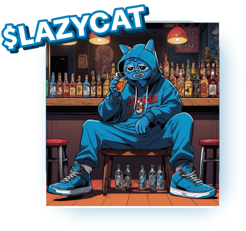

# LAZYCAT ERC-20 OFFICIAL

# [1] About the Lazycat

**Project Purpose  ::**
 - You agree that you are acquiring LAZYCAT to participate in the LAZYCAT ecosystem and to obtain services on the ecosystem thereon. The Company, the Distributor and their respective affiliates would develop and contribute to the underlying source code for the LAZYCAT ecosystem. The Company is acting solely as an arms’ length third party in relation to the LAZYCAT distribution, and not in the capacity as a financial advisor or fiduciary of any person with regard to the distribution of LAZYCAT.

**Nature of the Token Documentation  ::**
 - The Token Documentation is a conceptual paper that articulates some of the main design principles and ideas for the creation of a digital token to be known as LAZYCAT. The Token Documentation and the Website are intended for general informational purposes only and do not constitute a prospectus, an offer document, an offer of securities, a solicitation for investment, any offer to sell any product, item, or asset (whether digital or otherwise), or any offer to engage in business with any external individual or entity provided in said documentation. The information herein may not be exhaustive and does not imply any element of, or solicit in any way, a legally-binding or contractual relationship. There is no assurance as to the accuracy or completeness of such information and no representation, warranty or undertaking is or purported to be provided as to the accuracy or completeness of such information. Where the Token Documentation or the Website includes information that has been obtained from third party sources, the Company, the Distributor, their respective affiliates and/or the LAZYCAT early contributors have not independently verified the accuracy or completeness of such information. Further, you acknowledge that the project development roadmap, network functionality are subject to change and that the Token Documentation or the Website may become outdated as a result; and neither the Company nor the Distributor is under any obligation to update or correct this document in connection therewith.
## ▷ CHAIN INFO 
Chain : ERC-20 / BNB CHAIN 

## ▷ ALLOCATION OF FUNDS 
- Contract Address : 0x41ed891897117450adbd710006855b12f98cb86b
- Total Supply: 10 Billion LAZYCAT 
- 10,000,000,000 LAZYCAT

## ▷ Initial Distribution:

- Founders and Team: 5%

- Party Fund: 15%

- Tool Fund: 10% 

- Partnerships: 10%

- Community Airdrop: 10%

- Liquidity Pool: 50%

## ROADMAP

**PHASE 1**
  
- WEBSITE & SOCIAL MEDIA LAUNCH
- AIRDROP ACTIVE WALLETS
- INITIAL MARKETING CAMPAIGNS
- TOKENOMICS RELEASE
- ROADMAP RELEASE
  
**PHASE 2**

- AUDIT 
- CEX LISTING
- CMC LISTING
- SOCIAL MEDIA MARKETING
- PARTNERSHIPS
- COMMUNITY DEVELOPMENT

  
**PHASE 3**
  
- ECOSYSTEM DEVELOPMENT
- LISTING ON MAJOR CEX
- COMMUNITY GIVEAWAY
- ADVANCED MARKETING

## Technologies

- [Solidity]
  
# [2] Lazycat Utility
## Party Utility

- ### *Anonymous Chatting Application:*
  Connect with party people worldwide through our anonymous chat app, where all users are known as LazyCats. The app features rooms categorized by the amount of $LAZYCAT tokens held, creating exclusive spaces for users based on their token holdings. This tiered structure allows higher token holders to enjoy more advantages, such as free club tables and access to exclusive party spots, ensuring they party with peers who share similar financial statuses.
- ### *Event Tickets and VIP Access:*
  Use $LAZYCAT tokens to purchase tickets and gain VIP access to exclusive events, parties, and festivals.
- ### *Exclusive Merchandise:*
 Purchase limited edition event merchandise and artist collaborations using $LAZYCAT tokens.
- ### *Loyalty and Rewards Programs:*
  Earn $LAZYCAT tokens for attending events, participating in challenges, and engaging with the community. Redeem tokens for discounts, upgrades, and exclusive offers.
- ### *Token-Based Voting:*
  Use $LAZYCAT tokens to vote on setlists, special performances, and event activities, influencing the party experience.
- ### *Interactive Games and Challenges:*
   Participate in games and challenges at events to win $LAZYCAT tokens and other rewards.

## Tool Utility
- ### *Disperser:*
 Harness the power of the Disperser for your high-volume transaction needs. This robust tool allows developers to efficiently handle extensive airdrops, migrations, or presales. Capable of processing transactions for hundreds or even thousands of addresses at once, it ensures your distributions are extensive, accurate, and hassle-free.
- ### *Streamlined Transaction Flow:*
  The Disperser is designed to optimize your transaction processes, reducing the complexity and costs associated with mass distributions. Whether distributing tokens to a large user base or transferring assets between projects, the Disperser ensures swift and reliable execution, providing a seamless experience for both developers and recipients.
- ### *Token Safe:*
 LazyCat’s Token Safe is an essential tool for developers aiming to vest or lock team tokens, fostering transparency and trust within the community. It provides a clear and strategic schedule for token release into the market.
- ### *Enhanced Visibility with Lock Monitor:*
The Token Safe is complemented by the Lock Monitor feature, which allows anyone to view the lockup periods for each token. This significantly boosts transparency in token management, instilling confidence by making token lifecycle details openly accessible and verifiable by the community.

- ### *Liquidity Vault:*
  LazyCat’s Liquidity Vault offers a reliable solution to secure liquidity, providing visible assurance of project stability to the community. This feature locks liquidity, enhancing the project's credibility and longevity by preventing sudden withdrawals.
- ### *Transparency with Lock Monitor:*
  With the integration of the Lock Monitor, the Liquidity Vault ensures full transparency, enabling public verification of liquidity lock periods. This not only enhances security but also allows the community to personally confirm the project's commitment to maintaining stability
- ### *LazyCat Swap:*
   LazyCat Swap transforms the trading of tax tokens by implementing taxes directly on purchases. This groundbreaking method removes the need for swapbacks, simplifying the trading process and reducing sell pressure on market charts.
- ### *Market-Focused Trading Simplification:*
   By enhancing the mechanics of tax token trading, LazyCat Swap provides a more efficient and user-friendly experience. It promotes market stability and fosters healthier trading dynamics, benefiting the entire community with its innovative design.
- ### *Launcher:*
  LazyCat Token Launcher streamlines the process from token creation to deployment. It removes technical obstacles, offering an intuitive platform that allows anyone to create new tokens, regardless of coding knowledge. 
- ### *Democratizing Token Creation:*
  This tool makes token creation accessible to all, providing an effortless way to bring new tokens to the market. The LazyCat Token Launcher ensures that innovative ideas can come to life, fostering a diverse and vibrant crypto ecosystem.
- ### *Launchpad:*
  LazyCat Launchpad streamlines the fundraising process, providing a secure and user-friendly platform for developers to present their projects to potential supporters. This fosters trust and creates more opportunities for backing and collaboration. 
  
# [3] Contact
- 📧 lazycat@lazycat.wtf
- 📋 [homepage](https://lazycat.wtf/)
- 📋 [x](https://x.com/LazyCatBase)
- 📋 [telegram](https://t.me/LazyCatBase)

